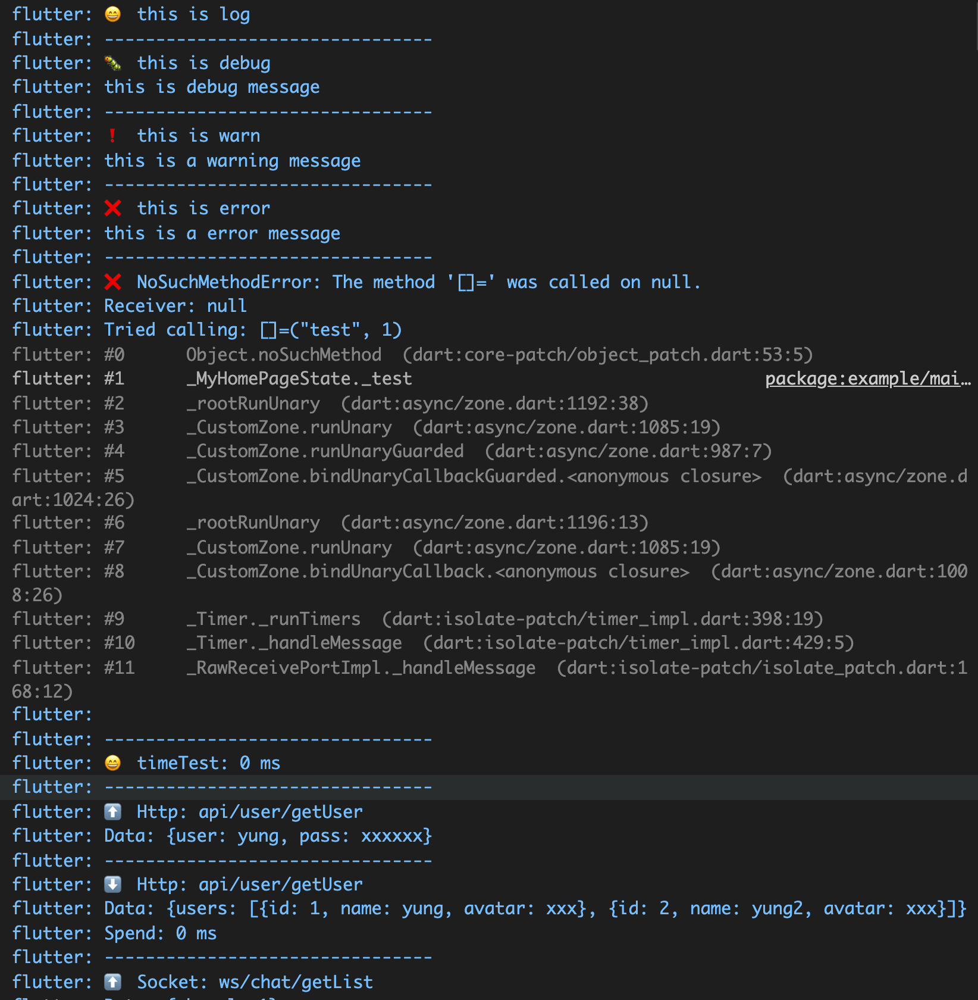
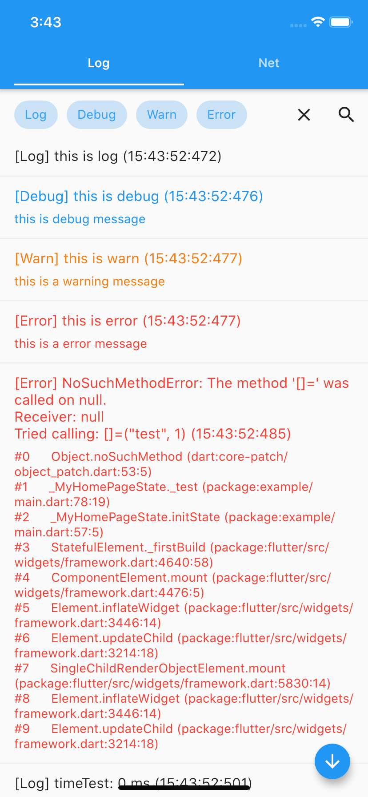
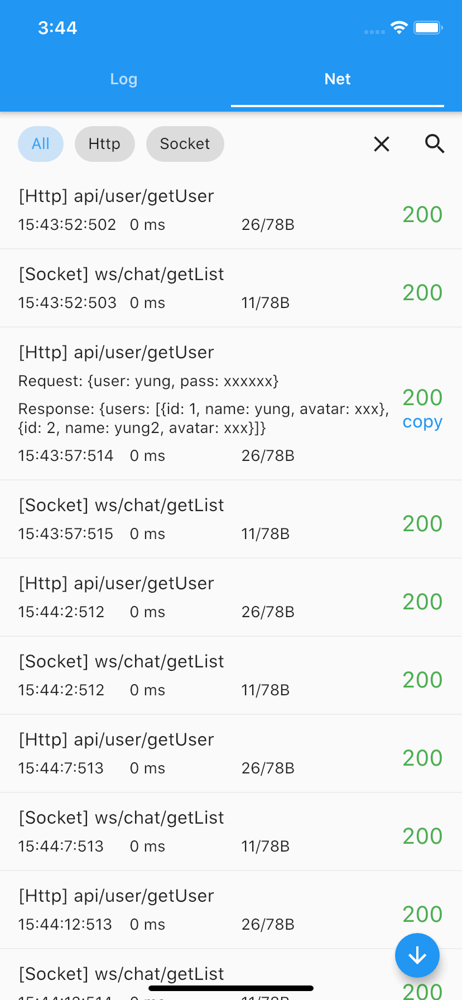
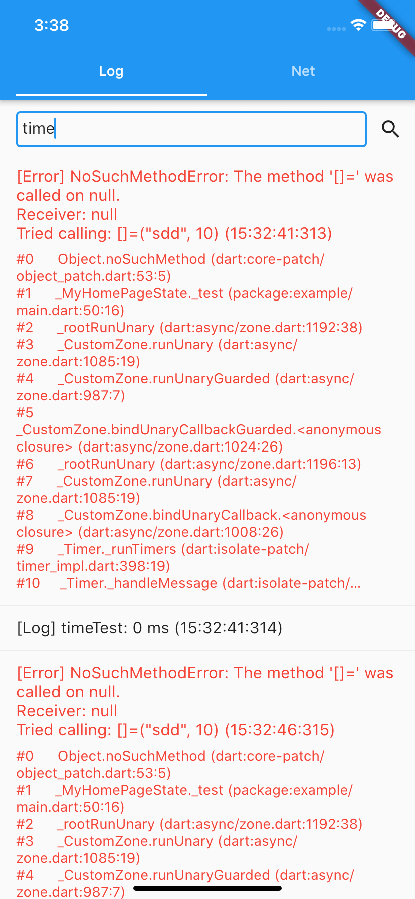
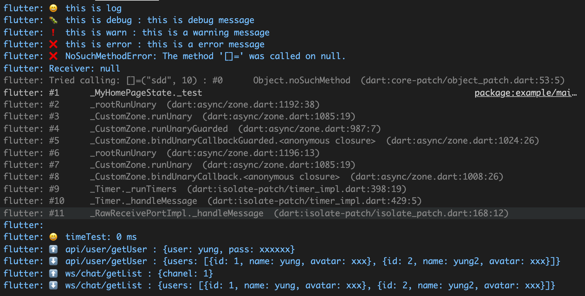

# let_log

LetLog is a log system that supports both IDE and in-app display, and supports log and network

Language: [English](README.md) | [中文简体](README_ZH.md)

## Getting Started

API inspired by web

**Example code**

```dart
// log
Logger.log("this is log");

// debug
Logger.debug("this is debug", "this is debug message");

// warn
Logger.warn("this is warn", "this is a warning message");

// error
Logger.error("this is error", "this is a error message");

// test error
try {
    final aa = {};
    aa["aaa"]["sdd"] = 10;
} catch (a, e) {
    Logger.error(a, e);
}

// time test
Logger.time("timeTest");
Logger.endTime("timeTest");

// log net work
Logger.net(
    "api/user/getUser",
    data: {"user": "yung", "pass": "xxxxxxx"},
    head: null,
);
Logger.endNet(
    "api/user/getUser",
    data: {
    "users": [
        {"id": 1, "name": "yung", "avatar": "xxx"},
        {"id": 2, "name": "yung2", "avatar": "xxx"}
    ]
    },
);

// log net work
Logger.net("ws/chat/getList", data: {" chanel": 1}, type: "Socket");
Logger.endNet(
    "ws/chat/getList",
    data: {
    "users": [
        {"id": 1, "name": "yung", "avatar": "xxx"},
        {"id": 2, "name": "yung2", "avatar": "xxx"}
    ]
    },
);

// clear log
// Logger.clear()
```

> For a detailed example, please refer to [here](example/lib/main.dart).

**IDE Display results**



**Display logs in the app**

```dart
Widget build(BuildContext context) {
    return Logger();
}
```

> For a detailed example, please refer to [here](example/lib/main.dart).

**App log**



**App network**



**App search**



**Setting**

Custom category names

```dart
// setting
// Logger.enabled = false;
// Logger.maxLimit = 10;
// Logger.showAsReverse = true;
Logger.setNames(
    log: "😄",
    debug: "So_1F41B",
    warn: "❗",
    error: "❌",
    request: "So_2B06_️",
    response: "⬇️",
);
```

Results:



## Feature

-   [x] Support for both IDE printing and in-app presentation

-   [x] Also supports logging, error, time statistics, network and other information output.

-   [x] Interface imitates the web console class, providing log, debug, warn interface, error, time, endTime, net, endNet, etc.

-   [x] Support for filtering log content by category

-   [x] Support for filtering log content by keywords

-   [x] Support for copy log content

-   [x] Serves as both Http and Socket

-   [x] Statistics for network support packet size, duration

-   [x] Support for custom log category symbols, you can use emoji sentiment as a sort if you like.

-   [x] Multi-colored output logs within the app to make error logs more visible

-   [x] Support for automatic switching between black and white skin according to the app

-   [x] Support for some custom logging settings

## github

> [https://github.com/yungzhu/let_log](https://github.com/yungzhu/let_log)

If you like it, give it a star, thanks.
